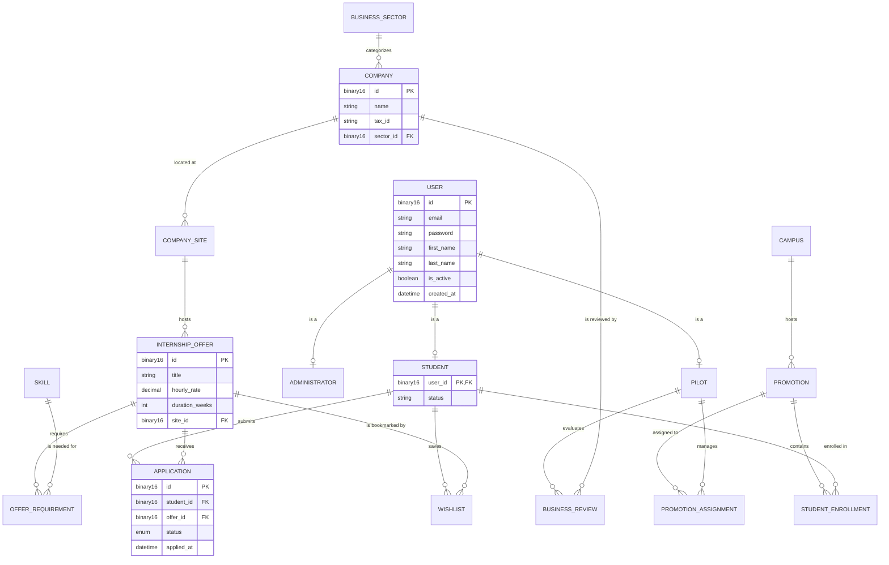

# StageFlow

> Plateforme web de recherche et gestion de stages — CESI Nancy, CPI 2ème année (2025–2026)

StageFlow centralise les offres de stages, les entreprises partenaires et les candidatures étudiantes dans une interface unique, adaptée à chaque profil utilisateur (administrateur, pilote de promotion, étudiant, visiteur anonyme).

---

## 🛠️ Manuel d'Installation

1. Lancer l'infrastructure Docker :

```bash
docker compose up -d

```

1. Accès aux environnements :

* **Production (Vhost PROD)** : [http://prod.localhost:8080](https://www.google.com/search?q=http://prod.localhost:8080)
* **Assets & Médias (Vhost CDN)** : [http://cdn.localhost:8080](https://www.google.com/search?q=http://cdn.localhost:8080)

## 🏗️ Architecture du Projet

Le projet suit une structure orientée MCV pour séparer la logique métier de l'accès aux données.

### 📁 Structure des Dossiers

* **`www/prod/`** : Point d'entrée de l'application et contrôleurs de pages.
* **`www/prod/.back/`** : Logique serveur masquée.
* `repository/` : Classes gérant les requêtes SQL (PDO).
* `util/` : Helpers (Rendu HTML, formatage, configuration).

* **`www/cdn/`** : Stockage des templates HTML statiques, CSS, JS et uploads.

### 🗃️ Couche de Données (Model / Repositories)

Les interactions avec la base de données sont centralisées dans les classes suivantes :

| Repository | Responsabilités principales |
| --- | --- |
| **`OfferRepository`** | Recherche multicritères, pagination, consultation des détails, incrémentation des vues. |
| **`CompanyRepository`** | Liste des entreprises, filtrage par secteur, détails de l'entreprise. |
| **`UserRepository`** | Authentification, gestion des profils étudiants et pilotes. |

## 🚦 Logique de Recherche & Filtres

La recherche d'offres utilise une approche dynamique avec `WHERE 1=1` permettant d'empiler les filtres sans corrompre la requête SQL :

* Mots-clés : Recherche dans le titre, la description et le nom de l'entreprise.
* Localisation : Filtrage par ville via `DISTINCT` location.
* Entreprise : Filtrage par ID d'entreprise.
* Type de contrat : Stage, Alternance, CDI, etc.

## MCD de la BDD


